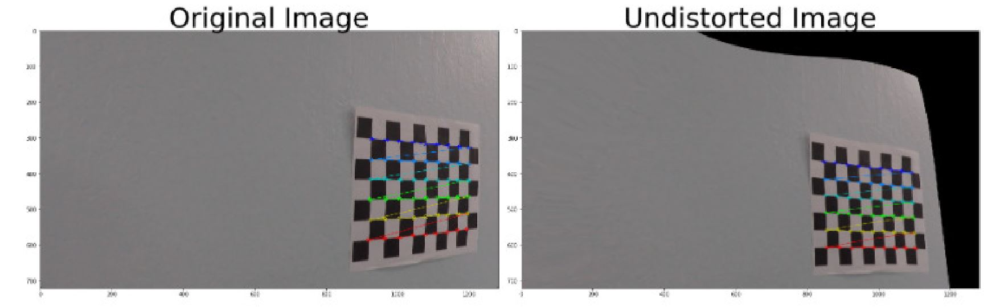
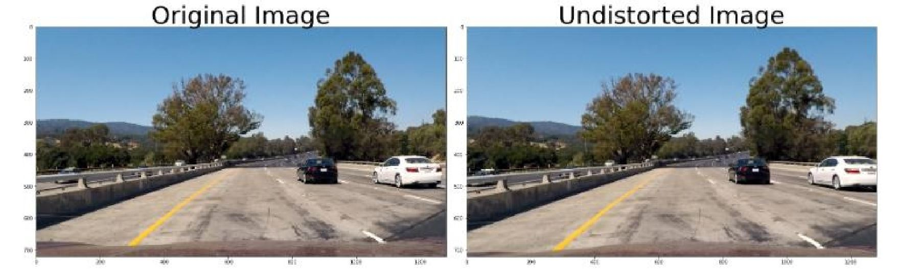
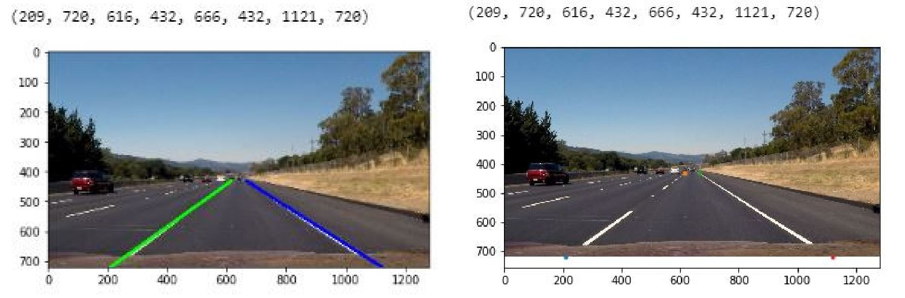
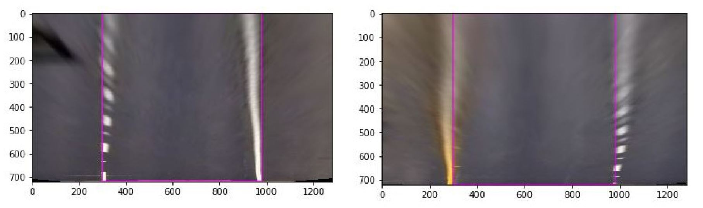
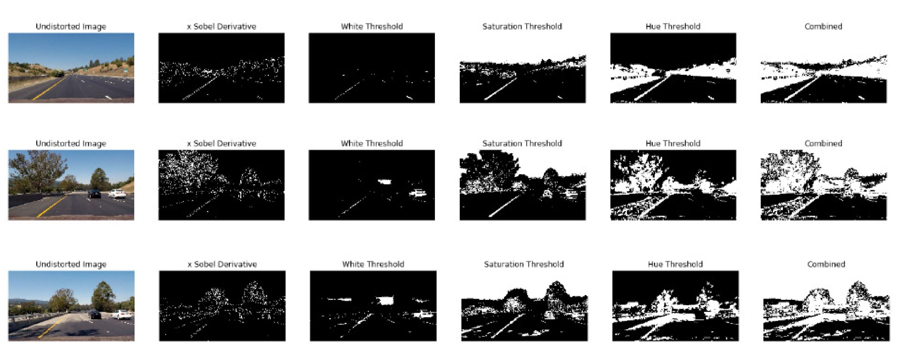
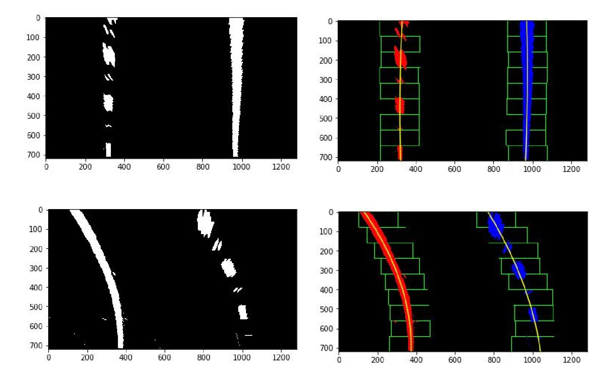
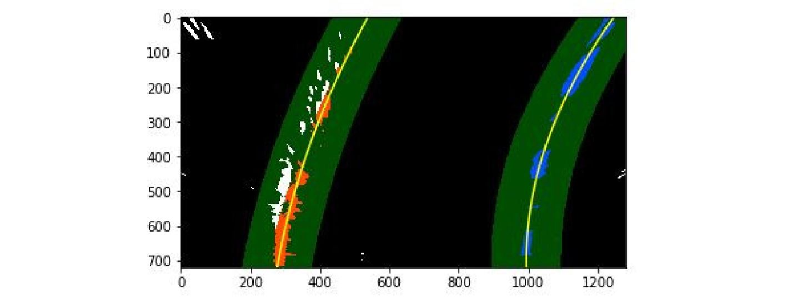

# Advanced Lane Finding 

Computer Vision algorithm to compute road curvature and lane vehicle offset using OpenCV Image Processing, Camera Calibration, Perspective Transform, Color Masks, Sobels and Polynomial Fit.


The *Advanced Lane Finding* project is a step further from [Lane Lines Detection](https://github.com/OanaGaskey/Lane-Lines-Detection) in identifying the geometry of the road ahead.

Using a video recording of highway driving, this project's goal is to compute the radius of the curvature of the road. Curved roads are a more challenging task than straight ones. To correctly compute the curvature, the lane lines need to be identified but on top of that, the images needs to be undistorted. Image transformation is necessary for camera calibration and for perspective transform to obtain a bird's eye view of the road.

This project is implemented in Python and uses OpenCV image processing library. The source code can be found in the `AdvancedLaneFinding.ipynb` Jupyter Notebook file above. 
The starter code for this project is provided by Udacity and can be found [here](https://github.com/udacity/CarND-Advanced-Lane-Lines).


## Camera Calibration

[Optic distortion](https://en.wikipedia.org/wiki/Distortion_(optics)) is a physical phenomenon that occurs in image recording, in which straight lines are projected as slightly curved ones when perceived through camera lenses. The highway driving video is recorded using the front facing camera on the car and the images are distorted. The distorsion coefficients are specific to each camera and can be calculated using known geometrical forms. 

Chessboard images captured with the embedded camera are provided in `camera_cal` folder. The advantage of these images is that they have high contrast and known geometry. The images provided present 9 * 6 corners to work with. 

```
# Object points are real world points, here a 3D coordinates matrix is generated
# z coordinates are 0 and x, y are equidistant as it is known that the chessboard is made of identical squares
objp = np.zeros((6*9,3), np.float32)
objp[:,:2] = np.mgrid[0:9,0:6].T.reshape(-1,2)
```

Object points are set based on the world’s knowledge that in a chess board pattern all squares are equal, this implies that object points will have x and y coordinates generated from grid indexes and z is always 0. The image points represent the corresponding object points found in the image using OpenCV’s function ‘findChessboardCorners’.  

```
# Convert to grayscale
gray = cv2.cvtColor(img, cv2.COLOR_BGR2GRAY)
# Find the chessboard corners
ret, corners = cv2.findChessboardCorners(gray, (nx, ny), None)
```

After scanning through all the images, the image points list has enough data to compare against the object points in order to compute camera matrix and distortion coefficients. This leads to an accurate camera matrix and distortion coefficients identification using ‘calibrateCamera’ function.

```
ret, mtx, dist, rvecs, tvecs = cv2.calibrateCamera(objpoints, imgpoints, gray.shape[::-1], None, None)
undist = cv2.undistort(img, mtx, dist, None, mtx)
```

OpenCV `undistort` function is used to transform the images using the camera matrix and distortion coefficients.



The result of the camera calibration technique is visible when comparing these pictures. While on the chessboard picture the distorsion is more obvious, for the road picture it's more subtile. Nevertheless,  undistorted pictured would lead to an incorrect road curvature calculation.




##  Perspective Transform from Camera Angle to Bird's Eye View

For road curvature calculation purposes, the ideal perspective is the bird's eye view. This means that the road is perceived from above, instead of at an angle through the vehicle's windshield.

This perspective transform is computed using a straight lane scenario and prior world knowledge that the lane lines are in fact parallel. 
Source and destination points are identified directly from the image for the perspective transform.



```
#Source points taken from images with straight lane lines, these are to become parallel after the warp transform
src = np.float32([
    (190, 720), # bottom-left corner
    (596, 447), # top-left corner
    (685, 447), # top-right corner
    (1125, 720) # bottom-right corner
])
# Destination points are to be parallel, taken into account the image size
dst = np.float32([
    [offset, img_size[1]],             # bottom-left corner
    [offset, 0],                       # top-left corner
    [img_size[0]-offset, 0],           # top-right corner
    [img_size[0]-offset, img_size[1]]  # bottom-right corner
])

```

OpenCV provides perspective transform functions to calculate the transformation matrix for the images given the source and destination points. Using `warpPerspective` function, the bird's eye view perspective transform is performed.

```
# Calculate the transformation matrix and it's inverse transformation
M = cv2.getPerspectiveTransform(src, dst)
M_inv = cv2.getPerspectiveTransform(dst, src)
warped = cv2.warpPerspective(undist, M, img_size)
```




##  Process Binary Thresholded Images 

The objective is to process the image in such a way that the lane line pixels are kept and easily differentiated from the road. Four transformations are applied and then combined.  

First is to take the x sobel on the gray scaled image. This represents the derivative in the x direction and helps detect lines that tend to be vertical. Only the values above a minimum threshold are kept.

```
# Transform image to gray scale
gray_img =cv2.cvtColor(img, cv2.COLOR_BGR2GRAY)
# Apply sobel (derivative) in x direction, this is usefull to detect lines that tend to be vertical
sobelx = cv2.Sobel(gray_img, cv2.CV_64F, 1, 0)
abs_sobelx = np.absolute(sobelx)
# Scale result to 0-255
scaled_sobel = np.uint8(255*abs_sobelx/np.max(abs_sobelx))
sx_binary = np.zeros_like(scaled_sobel)
# Keep only derivative values that are in the margin of interest
sx_binary[(scaled_sobel >= 30) & (scaled_sobel <= 255)] = 1
``` 

The second transformation is to select the white pixels in the gray scaled image. White is here defined by values between 200 and 255 which were picked using trial and error on the given pictures. 

```
# Detect pixels that are white in the grayscale image
white_binary = np.zeros_like(gray_img)
white_binary[(gray_img > 200) & (gray_img <= 255)] = 1
```

Third selection is on the saturation component using the HLS colorspace. This is particularly important to detect yellow lines on light concrete road. 

```
# Convert image to HLS
hls = cv2.cvtColor(img, cv2.COLOR_BGR2HLS)
H = hls[:,:,0]
S = hls[:,:,2]
sat_binary = np.zeros_like(S)
# Detect pixels that have a high saturation value
sat_binary[(S > 90) & (S <= 255)] = 1
```

Forth selection is on the hue component with values from 10 to 25 which have been identified to be corresponding to yellow. 

```
hue_binary =  np.zeros_like(H)
# Detect pixels that are yellow using the hue component
hue_binary[(H > 10) & (H <= 25)] = 1
```


 


## Lane Lines Detection Using Histogram

The lane line detection is performed on binary thresholded images that have already been undistorted and warped. Initially a histogram is computed on the image, this means that the pixels values are summed on each column to detect the most probable x position of left an right lane lines.  

```
# Take a histogram of the bottom half of the image
histogram = np.sum(binary_warped[binary_warped.shape[0]//2:,:], axis=0)
# Find the peak of the left and right halves of the histogram
# These will be the starting point for the left and right lines
midpoint = np.int(histogram.shape[0]//2)
leftx_base = np.argmax(histogram[:midpoint])
rightx_base = np.argmax(histogram[midpoint:]) + midpoint
```

Starting with these base positions on the bottom of the image, sliding window method is applied going upwards searching for line pixels. Lane pixels are considered when the x and y coordinates are within the area defined by the window. When enough pixels are detected to be confident they are part of a line, their average position is computed and kept as starting point for the next upward window.  

```
# Choose the number of sliding windows
nwindows = 9
# Set the width of the windows +/- margin
margin = 100
# Set minimum number of pixels found to recenter window
minpix = 50

# Identify window boundaries in x and y (and right and left)
win_y_low = binary_warped.shape[0] - (window+1)*window_height
win_y_high = binary_warped.shape[0] - window*window_height
win_xleft_low = leftx_current - margin
win_xleft_high = leftx_current + margin
win_xright_low = rightx_current - margin
win_xright_high = rightx_current + margin
      
# Identify the nonzero pixels in x and y within the window #
good_left_inds = ((nonzeroy >= win_y_low) & (nonzeroy < win_y_high) & 
(nonzerox >= win_xleft_low) &  (nonzerox < win_xleft_high)).nonzero()[0]
good_right_inds = ((nonzeroy >= win_y_low) & (nonzeroy < win_y_high) & 
(nonzerox >= win_xright_low) &  (nonzerox < win_xright_high)).nonzero()[0]
       
# Append these indices to the lists
left_lane_inds.append(good_left_inds)
right_lane_inds.append(good_right_inds)
```

All these pixels are put together in a list of their x and y coordinates. This is done symmetrically on the left line respectively on the right line. leftx, lefty, rightx, righty pixels positions are returned from the function and afterwards a second degree polynomial is fitted on each left and right side to find the best line fit of the selected pixels.

```
# Fit a second order polynomial to each with np.polyfit() ###
left_fit = np.polyfit(lefty, leftx, 2)
right_fit = np.polyfit(righty, rightx, 2)   
```

Here, the left and right line identified pixels are marked in red and blue respectively. The second degree polynomial is traced on the resulting image.

 


## Detection of Lane Lines Based on Previous Cycle

To speed up the lane line search from one video frame to the other information from the previous cycle is used.
It is more likely that the next image will have the lane lines in the proximity of the previous lane lines. This is where the polynomial fit for the left line and right line of the previous image are used to define the searching area. 
The sliding window method is still used but instead of starting with the histogram’s peak points, the search is conducted along the previous lines with a given margin for the window’s width. 

```
### Set the area of search based on activated x-values ###
### within the +/- margin of our polynomial function ###
left_lane_inds = ((nonzerox > (prev_left_fit[0]*(nonzeroy**2) + prev_left_fit[1]*nonzeroy + 
                prev_left_fit[2] - margin)) & (nonzerox < (prev_left_fit[0]*(nonzeroy**2) + 
                prev_left_fit[1]*nonzeroy + prev_left_fit[2] + margin))).nonzero()[0]
right_lane_inds = ((nonzerox > (prev_right_fit[0]*(nonzeroy**2) + prev_right_fit[1]*nonzeroy + 
                prev_right_fit[2] - margin)) & (nonzerox < (prev_right_fit[0]*(nonzeroy**2) + 
                prev_right_fit[1]*nonzeroy + prev_right_fit[2] + margin))).nonzero()[0]
# Again, extract left and right line pixel positions
leftx = nonzerox[left_lane_inds]
lefty = nonzeroy[left_lane_inds] 
rightx = nonzerox[right_lane_inds]
righty = nonzeroy[right_lane_inds]
```

The search returns leftx, lefty, rightx, righty pixel’s coordinates that are fitted with a second degree polynomial function for each left and right side.  



